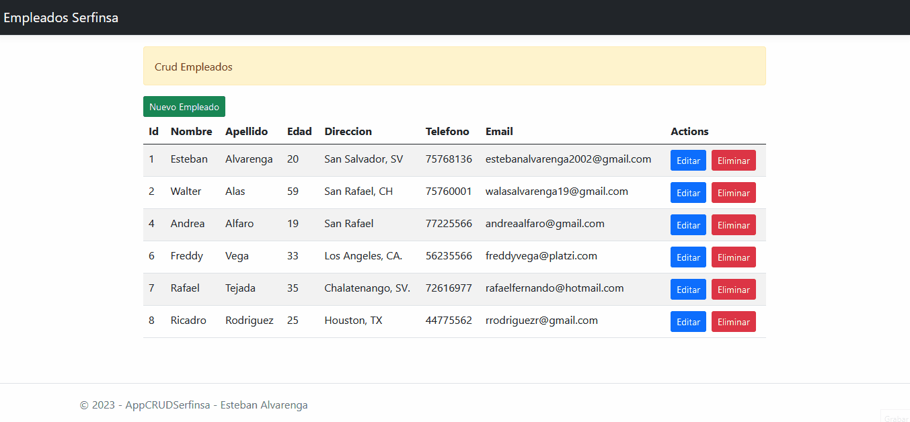

# GESTOR DE EMPLEADOS / EMPLOYEES MANAGEMENT 🫡

Registra a los empleados de tu empresa con su información personal, Lee, Guarda, Edita y Elimina registros. Ten la gestión completa a la base de datos de manera segura y persistente. 

## Instalación ⬇️

**Requisitos👮🏻‍♂️**

- Debes tener instalado en tu computadora Visual Studio, en cualquiera de sus versiones.
- Microsoft SQL Server Management, es necesario para poder crear nuestra base de datos creada y acceder a nuestro servidor local.

**Pasos🚶🏻‍♂️**

- Descarga el código en tu computadora o has un fork al repositorio 💻
- Coloca el proyecto en la carpeta de tu preferencia ✅
- Inicia Visual Studio, selecciona "Abrir proyecto" y ve a buscar la carpeta del proyecto en la ubicación donde lo colocaste anteriormente 📁
- Revisa que se hayan abierto correctamente 🧐
- Ejecuta el proyecto dando 'click' en el botón verde 'Ejecutar'/'http' ▶️ y espera a que Visual Studio inicie el servidor local, y despliegue el proyecto en el navegador 📉 

Ahora podrás ver la aplicación y comenzar a usarlo.

## Flujo de trabajo ▶️🔄

En nuestra página principal, tendrás una tabla con los registros existentes, o sin registros en caso de no tener ninguno agregado en la base de datos aún. Empieza dando 'click' al botón 'Nuevo Empleado'. Se desplegará una ventana modal, donde deberás completar los campos con la información del empleado que está por crearse. Cuando completes la información, ve al botón 'Guardar'.
Cuando finalmente tengas tu empleado registrado, a la derecha tendrás botones de accion, mediante los cuales puedes editar la información del usuario, o eliminarlo de ser necesario.
Al antes y mediante la creación o eliminación de registros, la aplicación te mostrará alertas, para que puedas verificar si la acción se ha cumplido.

## Herramientas, Librerias y Tecnologías usadas 📚

- C# ASP.NET / ADO.NET 7.0v
- MSSQL Server Management
- Procedimientos Almacenados
- Patrón de diseño MVC
- RESTful API
- JavaScript, jQuery
- Sweet Alerts
- Bootstrap 5.1v
- HTML, CSS

## Historia del proyecto 📖

Este proyecto es una prueba técnica que desarrollé para la empresa SERFINSA El Salvador. Para trabajar con ellos como Desarrollador Junior. La prueba la logré exitosamente en el tiempo requerido. Era necesario desarrollar la prueba usando C# .NET y MVC 💻
La prueba únicamente solicitó hacer el mantenimiento completo a la base de datos (CRUD) y quedó de manera opcional la manera de resolverla, las librerías y el estilo de la interfaz era opcional.

## English

Register the employees of your company with their personal information, Read, Save, Edit and Delete records. Have complete management of the database in a secure and persistent manner.

## Installation ⬇️

**Requirements👮🏻‍♂️**

- You must have Visual Studio installed on your computer, in any of its versions.
- Microsoft SQL Server Management, it is necessary to be able to create our database created and access our local server.

**Steps🚶🏻‍♂️**

- Download the code on your computer or fork the repository 💻
- Place the project in the folder of your preference ✅
- Launch Visual Studio, select "Open Project" and go find the project folder in the location where you previously placed it 📁
- Check that they have been opened correctly 🧐
- Run the project by 'clicking' on the green 'Run'/'http' button ▶️ and wait for Visual Studio to start the local server, and use the project in the browser 📉

Now you can see the application and start using it.

## Workflow ▶️🔄

On our home page, you will have a table with existing records, or no records in case none have been added to the database yet. Start by 'clicking' the 'New Employee' button. A modal window will be displayed, where you must complete the fields with the information of the employee that is about to be created. When you complete the information, go to the 'Save' button.
When you finally have your employee registered, on the right you will have action buttons, through which you can edit the user's information, or delete it if necessary.
Before and through the creation or deletion of records, the application will show you alerts, so you can verify if the action has been fulfilled.

## Tools, Libraries and Technologies used 📚

- C# ASP.NET/ADO.NET 7.0v
- MSSQL server management
- Stored Procedures
- MVC design pattern
- RESTful APIs
- JavaScript, jQuery
- Sweet alerts
- Bootstrap 5.1v
- HTML, CSS

## History of the project 📖

This project is a technical test that I developed for the company SERFINSA El Salvador. To work with them as a Junior Developer. I successfully completed the test in the required time. It was necessary to develop the test using C# .NET and MVC 💻
The test only requested full maintenance of the database (CRUD) and the way to resolve it, the libraries and the style of the interface were optional.
